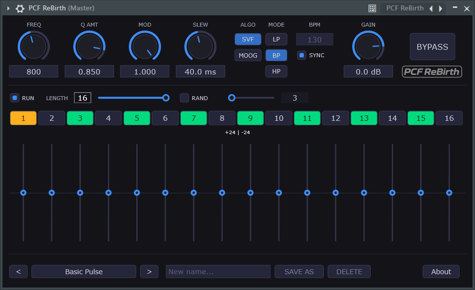
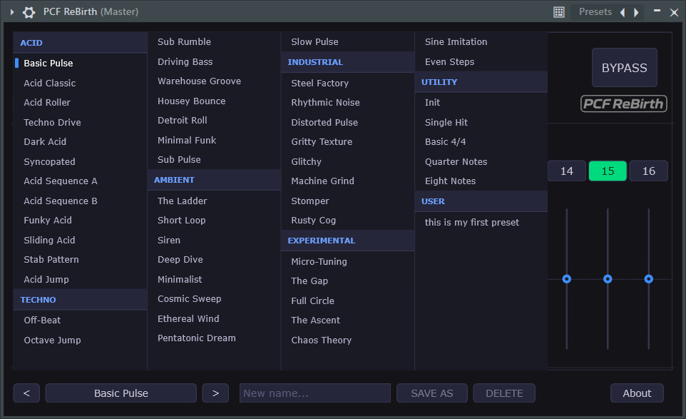
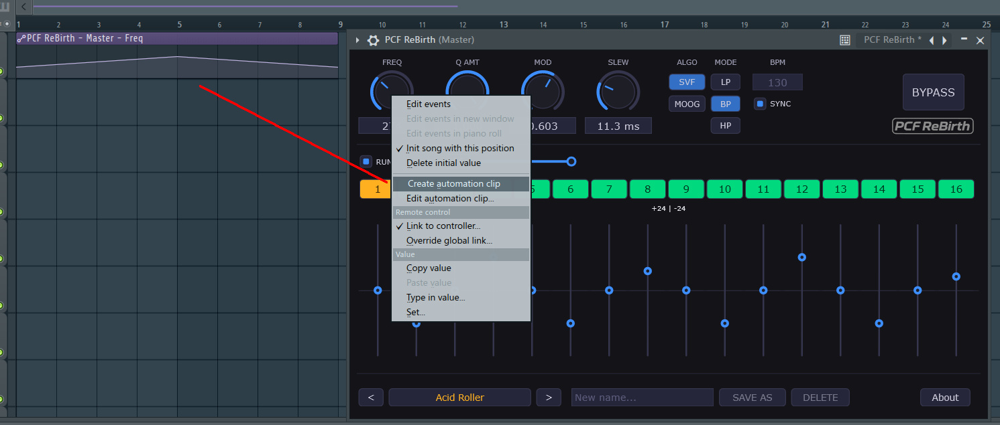

# PCF Rebirth

**PCF Rebirth** is a pattern controlled filter inspired by the PCF from Rebirth 338.
It combines a highly flexible 16-step sequencer with sophisticated filter emulations to create evolving, rhythmic textures.

## 📸 Preview

| Interface | Presets |
| :---: | :---: |
|  |  |

| Automation |
| :---: |
|  |

## ✨ Features

### 🎹 Step Sequencer
- **16-Step Grid:** Full control over pitch and gate for every step.
- **Expressive Modulation:** Integrated pitch glide, accent smoothing, and gate slew (attack/decay).
- **Dynamic Patterns:** Real-time adjustment of pattern length (from 1 to 16 steps).
- **Visual Feedback:** Real-time indication of active steps and current playback position.

### 🎛️ Powerful Filtering
- **Filter Modes:** Choose between classic **Lowpass (LP)**, **Bandpass (BP)**, or a rich **Moog-style Ladder Filter** emulation.
- **Dynamic Cutoff:** The cutoff frequency is modulated by the sequencer's gate and accent levels for organic movement.
- **High Precision:** Sample-accurate timing and smoothed parameter ramps to prevent digital clicks.

### 💾 Preset Management
- **Factory Presets:** Includes a curated collection of Acid, Techno, Ambient, Industrial, and Experimental patterns.
- **User Presets:** Save your own creations directly within the plugin. User presets are stored locally in your application data folder.

## 🛠 Technical Details
- **Framework:** Built with [JUCE Framework version 8](https://juce.com/).
- **Language:** C++
- **Architecture:** Optimized for low-latency real-time audio processing using double-buffered state management to ensure thread safety between the UI and Audio threads.
- **License:** MIT License.

## 🚀 Installation & Usage

### Installation
1. Download the latest release for your operating system (Windows/macOS).
2. Copy the plugin file (`.vst3`, `.component`, or `.au`) into your DAW's plugin folder:
   - **Windows:** `C:\Program Files\Common Files\VST3`
   - **macOS:** `/Library/Audio/Plug-Ins/Components` or `/Library/Audio/Plug-Ins/VST3`
3. Scan for new plugins in your Digital Audio Workstation (Ableton Live, FL Studio, Logic Pro, Bitwig, etc.).

### How to use
1. **Set the Tempo:** Use the BPM display. You can manually enter a value or toggle **SYNC** to follow your DAW's transport.
2. **Program the Sequence:** 
   - Click the **Step Buttons** (numbered 1-16) to turn gates on/off.
   - Adjust the **Vertical Sliders** below each button to change the pitch per step.
3. **Sculpt the Sound:** Use the **Freq**, **Q Amt**, and **Env Mod** knobs to shape the filter's character.
4. **Manage Presets:** Use the preset browser at the bottom to navigate factory sounds or use the "SAVE AS" button to store your own patterns.

## 🤝 Contributing
Contributions are welcome! If you find a bug or have a feature request, please open an issue or submit a pull request.

## 📜 License
This project is licensed under the **MIT License** - see the [LICENSE](LICENSE) file for details.

---

**Created by [Reiner Prokein](https://github.com/ReinerBforartists)**
